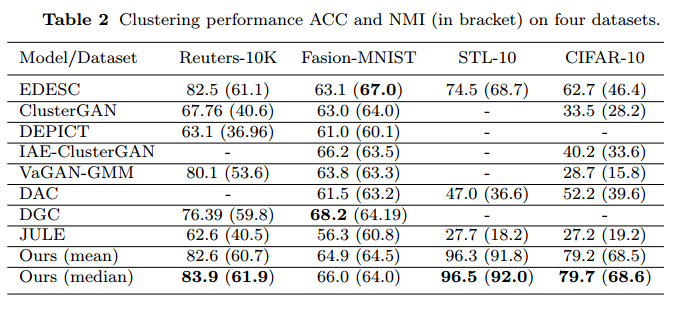

**Introduction**: Clustering is of central importance  to many computer vision applications such as image understanding, indexing, searching,  and product quantization. Recent advances on deep neural networks have brought promising solutions for  clustering analysis.  This paper presents a deep autoencoder model to learn discriminative representations for  clustering. Specifically, we derive a correlation loss by using  probabilistic similarities of  pairwise distances. This loss is incorporated at several layers of the model to preserve local structures of underlying data. In addition, a novel loss function based on affinity distances in the probabilistic space is presented to learn important clustering features. Moreover, we also ultilize a clustering-oriented loss based on KL divergence to enhance the latent features. The proposed model has been validated by extensive experiments in comparison with the state-of-the-art methods and achieved promising clustering accuracy  on  four benchmark  datasets:  Fashion-MNIST (66.0%), CIFAR-10 (77.5%$), STL-10 (96.5%), and Reuters-10K (83.9%). 

**Datasets**:  We have selected 4  classification benchmark  datasets including: Reuters, Fashion-MNIST, CIFAR-10, and STL-10. Due to   memory limitation of our GPU machine, it is not possible to handle the whole CIFAR-10 dataset composing of 60,000 images. Hence, we randomly sampled 30,000 images for evaluation. For Reuters dataset, we have selected the Reuters-10K dataset that have been used for comparative evaluation in the work EDESC  at this host: https://github.com/JinyuCai95/EDESC-pytorch.  

**Results**: see details in results_report.txt for 10 running trials and Table 2 below.

**Visualization results using t-SNE (see Figure below):**

